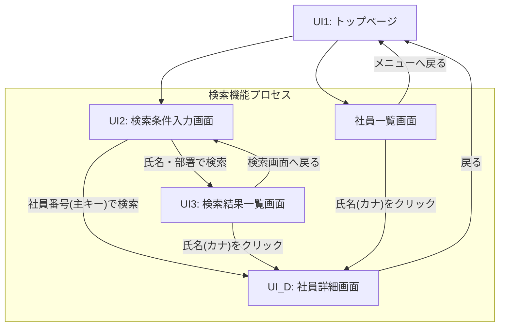

# 総合演習ガイド：社員情報管理システム (EIMS)

## 1. 演習概要
この演習では、社員情報を管理する Web ベースのアプリケーションを構築します。
システム名は **EIMS (Employee Information Management System)** です。

### 1.1 検索・表示機能の仕様定義
人事部の管理者が特定の社員を特定し、その詳細情報を確認するための機能群です。

#### 1.1.1 検索機能
各検索フォームからのリクエストに基づき、以下のロジックでデータベースを検索します。

| 検索方式 | 処理内容 |
|---|---|
| **社員番号検索** | 社員番号（主キー）を条件に検索を行う。該当する社員が存在する場合、直接「社員詳細画面」を表示する。 |
| **社員名検索** | 氏名（氏または名）をキーワードとし、部分一致検索を行う。検索結果は 「検索結果一覧画面」 に表示する。 |
| **部署検索** | 部署情報を条件に検索を行う。検索結果は 「検索結果一覧画面」 に表示する。 |

##### 【社員名検索の入力例】
以下の入力例に基づき検索ロジックを実装すること。
- **例 1**: 「田」が入力された場合、**氏（lname）** または **名（fname）** のいずれかに「田」を含む社員を検索対象とする。

##### 【共通の挙動ルール】
- **入力値の検証**: キーワードが null または空文字の場合は、遷移を行わず検索画面に留まること。

#### 1.1.2 検索結果一覧画面および社員詳細画面
検索の結果得られた情報を、以下のルールに従って表示する。

- **検索結果一覧画面**:
    - 以下の 4 項目をテーブル形式で表示する。
        1. **社員番号**
        2. **氏名 (カナ)**： 「氏 名 (氏カナ 名カナ)」の形式で連結して表示する。
        3. **性別**： DB値が 1 なら「男性」、2 なら「女性」と置換して表示する。
        4. **部署名**
    - **氏名 (カナ) をクリック**することで、対象社員の「社員詳細画面」へ遷移できる導線を設けること。
    - 検索結果が 0 件の場合は、テーブルを表示せず「該当する社員は存在しませんでした」というメッセージを提示すること。
    - **「検索画面に戻る」** または **「メニューに戻る」** ためのボタンを適切に配置すること。
- **社員詳細画面**:
    - 特定された社員の全項目を表示する。
    - この画面を起点とし、後のステップで実装する「変更」「削除」の機能へ繋げる。
- **共通の表示ルール**:
    - 氏名、カナを表示する際は、名字と名前の間を**半角スペース**で連結すること。

#### 1.1.3 検索・表示における実装方針と簡略化指針
チームの進捗状況に合わせ、以下のいずれかの方針を選択すること。

| 項目 | 標準的な実装（推奨） | 簡略化された実装 |
|---|---|---|
| **バリデーション** | null・空文字の入力チェックを実装 | 特になし（エラーを回避できれば可） |
| **0件時の制御** | メッセージ表示による分岐処理を実装 | 特になし（空の表を表示） |
| **氏名検索範囲** | **氏** または **名** の 2 項目 OR 検索 | **氏（漢字）** のみの単一項目検索 |
| **部署検索方式** | **部署名** をプルダウンで選択 | **部署コード** をテキストで入力 |

---

### 1.2 社員情報の登録機能
（※検索機能の完了後に定義）

---

### 1.3 社員情報の更新機能
（※後のステップで定義）

---

### 1.4 社員情報の削除機能
（※後のステップで定義）

---

## 2. 演習の進め方
（原本 Page 4 に準拠）

---

## 3. 画面遷移図（検索機能プロセス）

