

  
     
  <h1 style="border: none; font-size: 2.5em; color: #1a365d;">アプリ総合演習ガイド</h1>
  <h2 style="color: #666; font-weight: 300;">社員情報管理システム (EIMS)</h2>
        

## 目次

- 1\. 演習概要 ...... p.3
- 1.1 検索・表示機能の仕様定義 ...... p.3
  - 1.1.1 検索機能 ...... p.3
  - 1.1.2 検索結果一覧画面および社員詳細画面 ...... p.4
  - 1.1.3 検索・表示における実装方針と簡略化指針 ...... p.5
- 1.2 社員情報の登録機能 ...... p.6
  - 1.2.1 登録機能 ...... p.6
  - 1.2.2 登録画面・登録確認画面・登録完了画面 ...... p.7
  - 1.2.3 登録における実装方針と簡略化指針 ...... p.8
- 1.3 社員情報の更新機能 ...... p.9
  - 1.3.1 更新機能 ...... p.9
  - 1.3.2 変更画面・変更確認画面・変更完了画面 ...... p.10
  - 1.3.3 更新における実装方針と簡略化指針 ...... p.11
- 1.4 社員情報の削除機能 ...... p.12
  - 1.4.1 削除機能 ...... p.12
  - 1.4.2 削除確認画面・削除完了画面 ...... p.13
  - 1.4.3 削除における実装方針と簡略化指針 ...... p.13
- 2\. 演習の進め方
- 3\. ユースケース
  - 3.1 ユースケース図
  - 3.2 ユースケース仕様書
- 4\. UIフロー図
- 5\. 画面レイアウト図
- 6\. データベース仕様
- 7\. クラス図（分析レベル）
- 8\. シーケンス図（分析レベル）
- 9\. クラス図（設計レベル）
- 10\. シーケンス図（設計レベル）

  <h1 style="border: none; font-size: 1.8em; color: #1a365d; margin-bottom: 5px;">アプリ総合演習ガイド</h1>
  社員情報管理システム (EIMS)

## 1. 演習概要
この演習では、社員情報を管理する Web ベースのアプリケーションを構築する。
システム名は **EIMS (Employee Information Management System)** である。

---

### 1.1 検索・表示機能の仕様定義
人事部の管理者が特定の社員を特定し、その詳細情報を確認するための機能群。

#### 1.1.1 検索機能
各検索フォームからのリクエストに基づき、以下のロジックでデータベースを検索する。

| 検索方式 | 処理内容 |
|---|---|
| **社員番号検索** | 社員番号（主キー）を条件に検索を行う。該当する社員が存在する場合、直接「社員詳細画面」を表示する。 |
| **社員名検索** | 氏名（氏または名）をキーワードとし、部分一致検索を行う。検索結果は 「検索結果一覧画面」 に表示する。 |
| **部署検索** | 部署情報を条件に検索を行う。検索結果は 「検索結果一覧画面」 に表示する。 |

##### 【社員名検索の入力例】
以下の入力例に基づき検索ロジックを実装すること。
- **例 1**: 「田」が入力された場合、**氏（lname）** または **名（fname）** のいずれかに「田」を含む社員を検索対象とする。

##### 【共通の挙動ルール】
- **入力値の検証**: キーワードが null または空文字の場合は、遷移を行わず検索画面に留まること。

#### 1.1.2 検索結果一覧画面および社員詳細画面
検索の結果得られた情報を、以下のルールに従って表示する。

- **検索結果一覧画面**:
    - 以下の 4 項目をテーブル形式で表示する。
        1. **社員番号**
        2. **氏名 (カナ)**： 「氏 名 (氏カナ 名カナ)」の形式で連結して表示する。
        3. **性別**： DB値が 1 なら「男性」、2 なら「女性」と置換して表示する。
        4. **部署名**
    - **氏名 (カナ) をクリック**することで、対象社員の「社員詳細画面」へ遷移できる導線を設けること。
    - 検索結果が 0 件の場合は、テーブルを表示せず「該当する社員は存在しませんでした」というメッセージを提示すること。
    - **「検索画面に戻る」** または **「メニューに戻る」** ためのボタンを適切に配置すること。
- **社員詳細画面**:
    - 検索結果一覧画面と同じ 4 項目（社員番号、氏名(カナ)、性別、部署名）を表示する。
    - この画面を起点とし、後のステップで実装する「変更」「削除」の機能へ繋げる。
- **共通の表示ルール**:
    - 氏名、カナを表示する際は、名字と名前の間を**半角スペース**で連結すること。

#### 1.1.3 検索・表示における実装方針と簡略化指針
チームの進捗状況に合わせ、以下のいずれかの方針を選択すること。

| 項目 | 標準的な実装（推奨） | 簡略化された実装 |
|---|---|---|
| **バリデーション** | null・空文字の入力チェックを実装 | 特になし（エラーを回避できれば可） |
| **0件時の制御** | メッセージ表示による分岐処理を実装 | 特になし（空の表を表示） |
| **氏名検索範囲** | **氏** または **名** の 2 項目 OR 検索 | **氏（漢字）** のみの単一項目検索 |
| **部署検索方式** | **部署名** をプルダウンで選択 | **部署コード** をテキストで入力 |

---

### 1.2 社員情報の登録機能
新しい社員の情報をデータベースへ登録するための機能群。

#### 1.2.1 登録機能
登録画面から送信された社員情報を検証し、データベースへ保存する。

- **入力項目**:

    | 項目 | 入力方式 | バリデーション条件 |
    |---|---|---|
    | 氏 | テキスト入力 | 必須、10文字以内 |
    | 名 | テキスト入力 | 必須、10文字以内 |
    | 氏（カナ） | テキスト入力 | 必須、20文字以内 |
    | 名（カナ） | テキスト入力 | 必須、20文字以内 |
    | パスワード | パスワード入力 | 必須、4文字以上16文字以内 |
    | 性別 | ラジオボタン（男性/女性） | 必須、初期状態は未選択 |
    | 部署 | セレクトメニュー（部署テーブルより取得） | 必須 |

- **社員番号**: データベースの自動採番機能（AUTO_INCREMENT）を使用する。入力項目には含めない。
- **バリデーションエラー時**: 登録画面に戻り、エラーメッセージを表示する。入力済みの値は保持すること。

#### 1.2.2 登録画面・登録確認画面・登録完了画面
登録プロセスにおける各画面の仕様を以下に定義する。

- **登録画面**:
    - 上記 1.2.1 の入力項目を配置し、ユーザーからの入力を受け付ける。
    - **「登録」ボタン** および **「メニューに戻る」ボタン** を配置すること。
- **登録確認画面**:
    - 登録画面で入力された内容を、読み取り専用で一覧表示する。
    - パスワードは **「●●●●●●●●」**（固定値）でマスク表示すること。
    - **「登録確定」ボタン** および **「修正する」ボタン** を配置すること。
    - 「修正する」ボタン押下時は、入力データが保持された状態で登録画面へ戻ること。
- **登録完了画面**:
    - 登録が正常に完了した旨のメッセージを表示する。
    - **「続けて登録する」ボタン** および **「メニューに戻る」ボタン** を配置すること。
    - 「続けて登録する」ボタン押下時は、全項目が空欄の登録画面を表示すること。

#### 1.2.3 登録における実装方針と簡略化指針
チームの進捗状況に合わせ、以下のいずれかの方針を選択すること。

| 項目 | 標準的な実装（推奨） | 簡略化された実装 |
|---|---|---|
| **登録フロー** | 入力 → **確認画面** → 完了 | 入力 → 完了（確認画面なし） |
| **「修正する」ボタンの挙動** | 入力値を保持した状態で登録画面へ戻る | 登録画面へ戻る（ただし入力値は空欄になる） |
| **性別の入力方式** | ラジオボタン（男性/女性） | テキスト入力（数値 1 または 2） |
| **部署の入力方式** | セレクトメニュー（部署名を選択） | テキスト入力（部署コードを入力） |
| **バリデーション** | 全項目の入力チェックを実装 | バリデーションなし |

---

### 1.3 社員情報の更新機能
既存の社員情報を変更し、データベースへ上書き保存するための機能群。
更新対象の社員は、社員詳細画面から選択する。

#### 1.3.1 更新機能
変更画面から送信された社員情報を検証し、データベースの既存レコードを上書き保存する。

- **更新対象の特定**: 社員詳細画面に表示されている社員番号（主キー）を基に、更新対象を特定する。
- **変更可能な項目**:

    | 項目 | 入力方式 | バリデーション条件 |
    |---|---|---|
    | 氏 | テキスト入力 | 必須、10文字以内 |
    | 名 | テキスト入力 | 必須、10文字以内 |
    | 氏（カナ） | テキスト入力 | 必須、20文字以内 |
    | 名（カナ） | テキスト入力 | 必須、20文字以内 |
    | パスワード | パスワード入力 | 必須、4文字以上16文字以内 |
    | 性別 | ラジオボタン（男性/女性） | 必須 |
    | 部署 | セレクトメニュー（部署テーブルより取得） | 必須 |

- **社員番号**: 変更不可。画面上に表示するが、入力フィールドとしては提供しない。
- **初期表示**: 変更画面を開いた時点で、現在の登録内容が各入力欄にセットされた状態で表示すること。
- **バリデーションエラー時**: 変更画面に戻り、エラーメッセージを表示する。入力済みの値は保持すること。

#### 1.3.2 変更画面・変更確認画面・変更完了画面
更新プロセスにおける各画面の仕様を以下に定義する。

- **変更画面**:
    - 社員番号を読み取り専用で表示し、その他の項目を編集可能な状態で表示する。
    - 各入力欄には、現在の登録データを初期値として表示すること。
    - **「変更」ボタン** および **「詳細画面に戻る」ボタン** を配置すること。
- **変更確認画面**:
    - 変更後の内容を、読み取り専用で一覧表示する。
    - パスワードは **「●●●●●●●●」**（固定値）でマスク表示すること。
    - **「変更確定」ボタン** および **「修正する」ボタン** を配置すること。
    - 「修正する」ボタン押下時は、入力データが保持された状態で変更画面へ戻ること。
- **変更完了画面**:
    - 変更が正常に完了した旨のメッセージを表示する。
    - **「メニューに戻る」ボタン** を配置すること。

#### 1.3.3 更新における実装方針と簡略化指針
チームの進捗状況に合わせ、以下のいずれかの方針を選択すること。

| 項目 | 標準的な実装（推奨） | 簡略化された実装 |
|---|---|---|
| **更新フロー** | 変更入力 → **確認画面** → 完了 | 変更入力 → 完了（確認画面なし） |
| **「修正する」ボタンの挙動** | 入力値を保持した状態で変更画面へ戻る | 変更画面へ戻る（ただし入力値は空欄になる） |
| **性別の入力方式** | ラジオボタン（男性/女性） | テキスト入力（数値 1 または 2） |
| **部署の入力方式** | セレクトメニュー（部署名を選択） | テキスト入力（部署コードを入力） |
| **バリデーション** | 全項目の入力チェックを実装 | バリデーションなし |

---

### 1.4 社員情報の削除機能
指定された社員情報をデータベースから削除（物理削除）するための機能群。
削除対象の社員は、社員詳細画面から選択する。

#### 1.4.1 削除機能
社員詳細画面に表示されている社員番号（主キー）を基に、対象レコードをデータベースから削除する。

- **削除の起点**: 社員詳細画面の「削除」ボタンより削除プロセスを開始する。
- **削除方式**: データベースからレコードを完全に削除する（物理削除）。
- **削除対象が存在しない場合**: 削除できない旨を表示すること。

#### 1.4.2 削除確認画面・削除完了画面
削除プロセスにおける各画面の仕様を以下に定義する。

- **削除確認画面**:
    - 削除対象の社員情報（社員番号、氏名+カナ、性別、部署名）を読み取り専用で表示する。
    - 「この社員を削除しますか？」のような確認メッセージを表示すること。
    - **「削除確定」ボタン** および **「詳細画面に戻る」ボタン** を配置すること。
- **削除完了画面**:
    - 削除が正常に完了した旨のメッセージを表示する。
    - **「メニューに戻る」ボタン** を配置すること。

#### 1.4.3 削除における実装方針と簡略化指針
チームの進捗状況に合わせ、以下のいずれかの方針を選択すること。

| 項目 | 標準的な実装（推奨） | 簡略化された実装 |
|---|---|---|
| **削除フロー** | 詳細画面 → **削除確認画面** → 完了 | 詳細画面 → 完了（確認画面なし） |
| **削除対象の確認表示** | 削除対象の社員情報を表示 | 表示なし |

---

## 2. 演習の進め方
以下の手順に従い、システムを構築すること。機能ごとに以下の作業を行う。

| 順序 | 作業 | 説明 | 成果物 |
|---|---|---|---|
| 1 | 要件定義の内容確認 | 以下の各種ドキュメントを元に、要件を理解する。 ・ユースケース図 ・ユースケース仕様書 ・UI フロー図 ・画面レイアウト図 | ※成果物の作成は不要。提供された資料を用いる。 |
| 2 | 設計の内容確認 | 設計レベルのクラス図の記述内容を理解する。 | ※成果物の作成は不要。提供された資料を用いる。 |
| 3 | プログラミング | 設計モデルどおりにコーディングする。 | ソースコード |
| 4 | テスト | 要求モデルのシナリオを基に単体・結合（機能）テストを行う。 | テストケース仕様書 テスト不具合報告書 動作するプログラム |

### 提供物について
本演習では、以下のものが事前に提供される。

| 提供物 | 説明 |
|---|---|
| **スターターキットプロジェクト** | 必要なライブラリ（依存関係）およびリソースファイル（イメージファイル、Bootstrap関連ファイルなど）が設定済みの Spring Boot プロジェクト。このプロジェクトをベースに開発を開始すること。 |
| **データベース構築ファイル** | テーブル作成スクリプトおよびテスト用初期データの投入スクリプト。講師の指示に従い、データベースのセットアップを行うこと。 |
| **各種設計ドキュメント** | 本ドキュメント内に、ユースケース図、ユースケース仕様書、UIフロー図、画面レイアウト図、クラス図（分析・設計レベル）、シーケンス図を収録している。 |
| **テストケース仕様書フォーマット** | テスト工程で使用する書式ファイル（.xls）。 |

### ドキュメントについて
各工程で作成・利用する成果物は以下の表の通り。

<table>
<thead>
<tr>
<th>工程</th><th>成果物</th><th>社員情報検索</th><th>社員情報登録</th><th>社員情報削除</th><th>社員情報変更</th>
</tr>
</thead>
<tbody>
<tr><td>要件定義</td><td>ユースケース図</td><td colspan="4" align="center">※</td></tr>
<tr><td>要件定義</td><td>ユースケース仕様書</td><td align="center">※</td><td align="center">※</td><td align="center">※</td><td align="center">※</td></tr>
<tr><td>要件定義</td><td>UI フロー図</td><td align="center">※</td><td align="center">※</td><td align="center">※</td><td align="center">※</td></tr>
<tr><td>要件定義</td><td>画面レイアウト図</td><td align="center">※</td><td align="center">※</td><td align="center">※</td><td align="center">※</td></tr>
<tr><td>設計</td><td>データベース仕様</td><td colspan="4" align="center">※</td></tr>
<tr><td>分析</td><td>クラス図（分析レベル）</td><td align="center">※</td><td align="center">※</td><td align="center">※</td><td align="center">※</td></tr>
<tr><td>分析</td><td>シーケンス図（分析レベル）</td><td align="center">※</td><td align="center">※</td><td align="center">※</td><td align="center">※</td></tr>
<tr><td>設計</td><td>クラス図（設計レベル）</td><td align="center">※</td><td align="center">※</td><td align="center">※</td><td align="center">※</td></tr>
<tr><td>設計</td><td>シーケンス図（設計レベル）</td><td align="center">※</td><td align="center">※</td><td align="center">※</td><td align="center">※</td></tr>
<tr><td>実装</td><td>ソースコード</td><td align="center">○</td><td align="center">○</td><td align="center">○</td><td align="center">○</td></tr>
<tr><td>テスト</td><td>テストケース仕様書.xls</td><td align="center">○</td><td align="center">○</td><td align="center">○</td><td align="center">○</td></tr>
<tr><td>テスト</td><td>テスト不具合報告書.xls</td><td align="center">○</td><td align="center">○</td><td align="center">○</td><td align="center">○</td></tr>
</tbody>
</table>

表の見方は次の通り。
- **「※」** ・・・ 本ドキュメントに収録、または提供される作成済みの資料を利用する。
- **「○」** ・・・ 自身で作成する。作成にあたっては、提供されるフォーマット（書式）を利用する。

また、データベースのテーブルレイアウトは確定済みである。「6. データベース仕様」を参照すること。

---

## 3. ユースケース

### 3.1 ユースケース図

社員情報管理

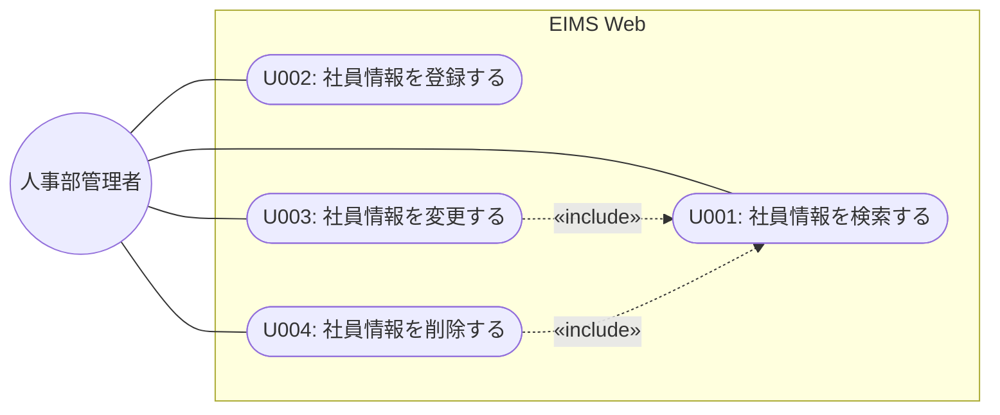
```mermaid
flowchart LR
    管理者((人事部管理者))
    
    subgraph EIMS Web
        UC1([U001: 社員情報を検索する])
        UC2([U002: 社員情報を登録する])
        UC3([U003: 社員情報を変更する])
        UC4([U004: 社員情報を削除する])
    end
    
    管理者 --- UC1
    管理者 --- UC2
    管理者 --- UC3
    管理者 --- UC4
    
    UC3 -.->|"«include»"| UC1
    UC4 -.->|"«include»"| UC1
```

- **U003（変更）** および **U004（削除）** は、対象社員を特定するために **U001（検索）** を包含（include）する。

### 3.2 ユースケース仕様書

#### UC001: 社員情報を検索する

| 項目 | 内容 |
|---|---|
| **ユースケースID** | UC001 |
| **ユースケース名** | 社員情報を検索する |
| **目的** | 社員番号による検索と、氏・名の部分一致検索と、部署名検索を行い、該当する社員情報の一覧を表示する。 |
| **アクター** | 人事部管理者 |
| **前提条件** | なし |

**事前条件:**
- EIMS データベースに社員テーブルと部署テーブルが作成されていること。
- EIMS データベースが正常に起動していること。

**基本フロー:**
1. [人事部管理者]は、システムに「社員の検索」を指示する。
2. システムは、EIMSデータベースからプルダウン用の部署一覧を取得し、検索画面を表示する。
3. [人事部管理者]は、社員番号・社員名・部署名のいずれかの入力条件で検索を指示する。
4. システムは、検索条件を用いて[EIMSデータベース]の検索を行い、検索結果一覧を表示する。（代替フロー alt4-1, alt4-2 参照）
5. [人事部管理者]は、表示された検索結果を確認し、ユースケースを終了する。（代替フロー alt5-1, alt5-2 参照）

**代替フロー:**
- **alt4-1.** 基本フロー4で該当する社員がいない（検索結果0件）場合、システムは、該当する社員が存在しないことを検索結果画面に表示する。
- **alt4-2.** 基本フロー3で社員番号による検索の場合、システムは、検索結果一覧を経由せず直接「社員詳細画面」を表示する。
- **alt5-1.** 基本フロー5で[人事部管理者]が再検索を指示した場合は、基本フロー2に戻り、システムは部署一覧を取得し、検索画面を表示する。
- **alt5-2.** 基本フロー5で[人事部管理者]はトップページに遷移することができる。
- **alt5-3.** 基本フロー5で[人事部管理者]が検索結果一覧の氏名+カナをクリックした場合、システムは対象社員の「社員詳細画面」を表示する。

**事後条件:**
- 検索を行った場合は、検索結果画面が表示されること。
- 検索結果が0件の場合は、その旨メッセージが画面に表示されること。
- 社員名検索の場合は、社員テーブルの「氏」または「名」のどちらかに検索条件を含む社員の情報が検索結果として表示されていること。
- 検索結果の表は「社員番号」「氏名+カナ」「性別」「部署名」の4列で構成され、「氏」・「名」および「氏(カナ)」・「名(カナ)」は半角スペース区切りで連結されていること。

**特記事項:** 特になし。

#### UC002: 社員情報を登録する

| 項目 | 内容 |
|---|---|
| **ユースケースID** | UC002 |
| **ユースケース名** | 社員情報を登録する |
| **目的** | 氏、名、氏（カナ）、名（カナ）、性別、部署、パスワードを入力して、一人分の社員情報を登録する。社員番号はシステムが自動採番する。 |
| **アクター** | 人事部管理者 |
| **前提条件** | なし |

**事前条件:**
- EIMS データベースに社員テーブルと部署テーブルが作成されていること。
- EIMS データベースが正常に起動していること。

**基本フロー:**
1. [人事部管理者]は、システムに「社員の登録」を指示する。
2. システムは、EIMSデータベースからプルダウン用の部署一覧を取得し、社員情報登録画面を表示する。
3. [人事部管理者]は、社員情報登録画面に登録する社員の情報を入力し、登録を指示する。（代替フロー alt3-1 参照）
4. システムは、入力された社員情報の妥当性を検証し、問題がない場合は登録確認画面を表示する。（代替フロー alt4-1 参照）
5. [人事部管理者]は、登録する社員の情報を確認し、問題がなければ登録を確定する。（代替フロー alt5-1 参照）
6. システムは、登録する社員の社員番号を生成し、社員情報を[EIMSデータベース]へ登録する。正常に登録できた場合は社員情報登録完了画面を表示する。
7. [人事部管理者]は、登録完了画面を確認し、ユースケースを終了する。（代替フロー alt7-1 参照）

**代替フロー:**
- **alt3-1.** 基本フロー3で、[人事部管理者]は、社員登録を中止することができる。
    1. [人事部管理者]は、登録中止を指示する。
    2. システムは、トップページを表示し、ユースケースを終了する。
- **alt4-1.** 基本フロー4で、社員情報に不正がある場合、システムは、基本フロー2に戻り、部署一覧を再取得した上で入力値と不正箇所を指摘するメッセージを表示して修正を促す。
- **alt5-1.** 基本フロー5で、[人事部管理者]は登録を取り消すことができる。
    1. [人事部管理者]は修正を指示する。
    2. システムは、部署一覧を再取得し、入力値を保持した状態で社員情報登録画面を表示する。
- **alt7-1.** 基本フロー7で、[人事部管理者]は、追加登録を指示することができる。
    1. [人事部管理者]が追加登録を指示する。
    2. システムは、基本フロー2に戻り、部署一覧を取得し、全ての項目が空欄の状態で社員情報登録画面を表示する。

**事後条件:**
- 登録が完了した場合は、登録完了画面が表示されていること。
- 登録が完了した場合は、EIMSデータベースに入力した社員のデータが保存されていること。

**特記事項:** 特になし。

#### UC003: 社員情報を変更する

| 項目 | 内容 |
|---|---|
| **ユースケースID** | UC003 |
| **ユースケース名** | 社員情報を変更する |
| **目的** | 既存の社員情報を変更し、EIMSデータベースを更新する。社員番号は変更不可とする。 |
| **アクター** | 人事部管理者 |
| **前提条件** | UC001（検索）により対象社員が特定されていること。 |

**事前条件:**
- EIMS データベースに社員テーブルと部署テーブルが作成されていること。
- EIMS データベースが正常に起動していること。
- 社員詳細画面が表示されていること。

**基本フロー:**
1. [人事部管理者]は、社員詳細画面から「社員の変更」を指示する。
2. システムは、EIMSデータベースからプルダウン用の部署一覧を取得し、現在の登録データをセットした社員情報変更画面を表示する。
3. [人事部管理者]は、変更内容を入力し、変更を指示する。（代替フロー alt3-1 参照）
4. システムは、入力された社員情報の妥当性を検証し、問題がない場合は変更確認画面を表示する。（代替フロー alt4-1 参照）
5. [人事部管理者]は、変更内容を確認し、問題がなければ変更を確定する。（代替フロー alt5-1 参照）
6. システムは、[EIMSデータベース]の対象レコードを更新し、変更完了画面を表示する。
7. [人事部管理者]は、変更完了画面を確認し、ユースケースを終了する。

**代替フロー:**
- **alt3-1.** 基本フロー3で、[人事部管理者]は、変更を中止することができる。
    1. [人事部管理者]は、変更中止を指示する。
    2. システムは、社員詳細画面に戻り、ユースケースを終了する。
- **alt4-1.** 基本フロー4で、社員情報に不正がある場合、システムは、基本フロー2に戻り、部署一覧を再取得した上で入力値と不正箇所を指摘するメッセージを表示して修正を促す。
- **alt5-1.** 基本フロー5で、[人事部管理者]は変更を取り消すことができる。
    1. [人事部管理者]は修正を指示する。
    2. システムは、部署一覧を再取得し、入力値を保持した状態で社員情報変更画面を表示する。

**事後条件:**
- 変更が完了した場合は、変更完了画面が表示されていること。
- 変更が完了した場合は、EIMSデータベースの対象社員のデータが更新されていること。

**特記事項:** 社員番号は変更不可。画面上に表示するが、入力フィールドとしては提供しない。

#### UC004: 社員情報を削除する

| 項目 | 内容 |
|---|---|
| **ユースケースID** | UC004 |
| **ユースケース名** | 社員情報を削除する |
| **目的** | 指定された社員の情報をEIMSデータベースから物理削除する。 |
| **アクター** | 人事部管理者 |
| **前提条件** | UC001（検索）により対象社員が特定されていること。 |

**事前条件:**
- EIMS データベースに社員テーブルと部署テーブルが作成されていること。
- EIMS データベースが正常に起動していること。
- 社員詳細画面が表示されていること。

**基本フロー:**
1. [人事部管理者]は、社員詳細画面から「社員の削除」を指示する。
2. システムは、削除対象の社員情報を表示した削除確認画面を表示する。
3. [人事部管理者]は、削除対象を確認し、削除を確定する。（代替フロー alt3-1 参照）
4. システムは、[EIMSデータベース]から対象レコードを削除し、削除完了画面を表示する。
5. [人事部管理者]は、削除完了画面を確認し、ユースケースを終了する。

**代替フロー:**
- **alt3-1.** 基本フロー3で、[人事部管理者]は削除を中止することができる。
    1. [人事部管理者]は、削除中止を指示する。
    2. システムは、社員詳細画面に戻り、ユースケースを終了する。

**事後条件:**
- 削除が完了した場合は、削除完了画面が表示されていること。
- 削除が完了した場合は、EIMSデータベースから対象社員のデータが削除されていること。

**特記事項:** 特になし。

---

## 4. UIフロー図

### 4.1 全体UIフロー図
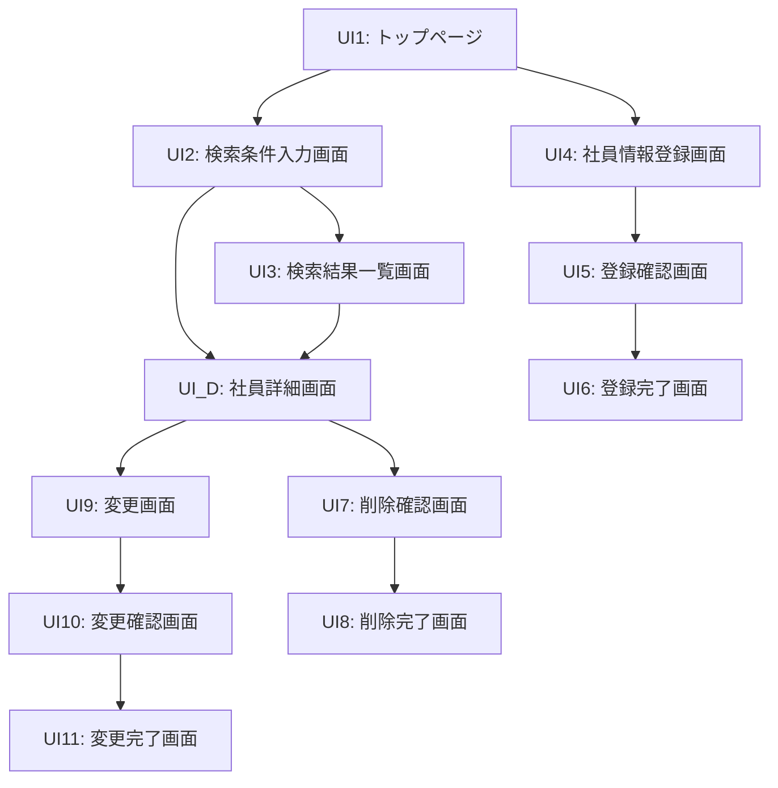
```mermaid
flowchart TD
    UI1[UI1: トップページ] --> UI2[UI2: 検索条件入力画面]
    UI1 --> UI4[UI4: 社員情報登録画面]
    
    UI2 --> UI_D[UI_D: 社員詳細画面]
    UI2 --> UI3[UI3: 検索結果一覧画面]
    UI3 --> UI_D
    
    UI4 --> UI5[UI5: 登録確認画面]
    UI5 --> UI6[UI6: 登録完了画面]
    
    UI_D --> UI9[UI9: 変更画面]
    UI9 --> UI10[UI10: 変更確認画面]
    UI10 --> UI11[UI11: 変更完了画面]
    
    UI_D --> UI7[UI7: 削除確認画面]
    UI7 --> UI8[UI8: 削除完了画面]
```

※図の煩雑化を防ぐため、各画面から「トップページ」や「検索画面」へ戻るルートは全体図では省略しています。各機能別のフロー図を参照してください。
※「検索画面へ戻る」「修正する」等による検索画面や入力画面への遷移は、ブラウザバック等ではなく必ずControllerへリクエストを送信し、毎回プルダウン用の部署一覧を再取得する設計とします。

### 4.2 機能別UIフロー図

#### UC001: 社員情報を検索する
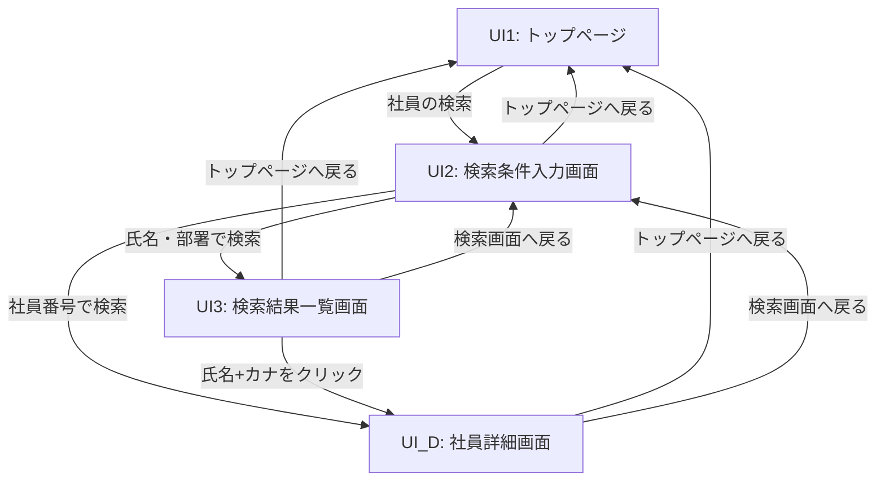
```mermaid
flowchart TD
    UI1[UI1: トップページ] -->|"社員の検索"| UI2[UI2: 検索条件入力画面]
    
    UI2 -- "社員番号で検索" --> UI_D[UI_D: 社員詳細画面]
    UI2 -- "氏名・部署で検索" --> UI3[UI3: 検索結果一覧画面]
    
    UI3 -- "氏名+カナをクリック" --> UI_D
    
    UI2 -->|"トップページへ戻る"| UI1
    UI3 -->|"トップページへ戻る"| UI1
    UI3 -->|"検索画面へ戻る"| UI2
    UI_D -->|"トップページへ戻る"| UI1
    UI_D -->|"検索画面へ戻る"| UI2
```

#### UC002: 社員情報を登録する
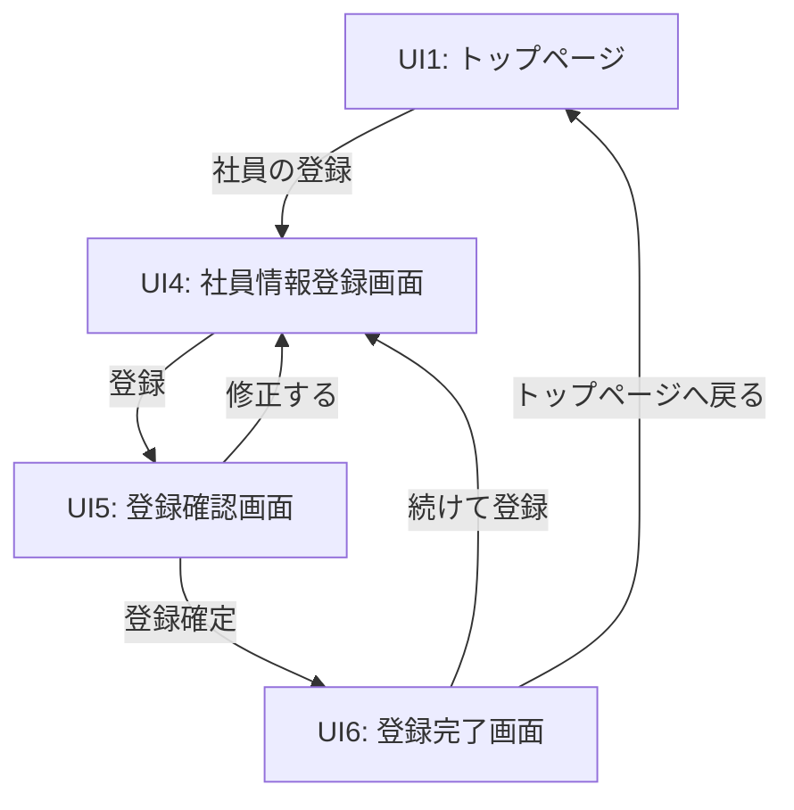
```mermaid
flowchart TD
    UI1[UI1: トップページ] -->|"社員の登録"| UI4[UI4: 社員情報登録画面]
    
    UI4 -- "登録" --> UI5[UI5: 登録確認画面]
    UI5 -- "登録確定" --> UI6[UI6: 登録完了画面]
    
    UI5 -- "修正する" --> UI4
    UI6 -- "続けて登録" --> UI4
    UI6 -->|"トップページへ戻る"| UI1
```

#### UC003: 社員情報を変更する
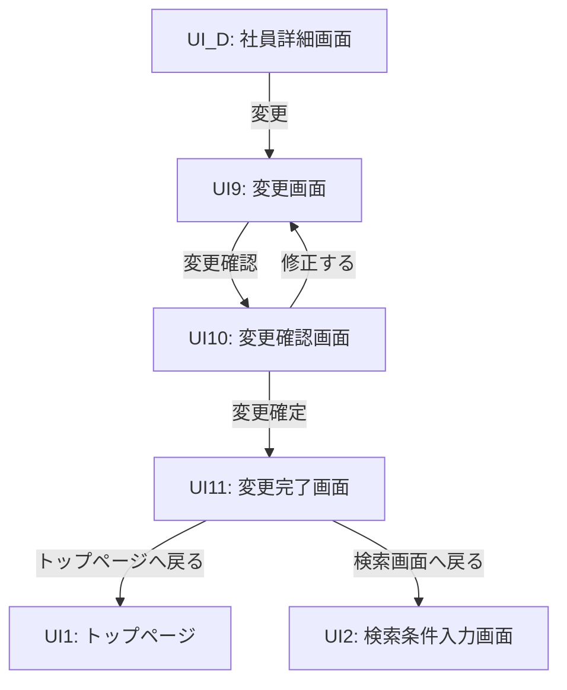
```mermaid
flowchart TD
    UI_D[UI_D: 社員詳細画面] -- "変更" --> UI9[UI9: 変更画面]
    
    UI9 -- "変更確認" --> UI10[UI10: 変更確認画面]
    UI10 -- "変更確定" --> UI11[UI11: 変更完了画面]
    
    UI10 -- "修正する" --> UI9
    UI11 -->|"トップページへ戻る"| UI1[UI1: トップページ]
    UI11 -->|"検索画面へ戻る"| UI2[UI2: 検索条件入力画面]
```

#### UC004: 社員情報を削除する
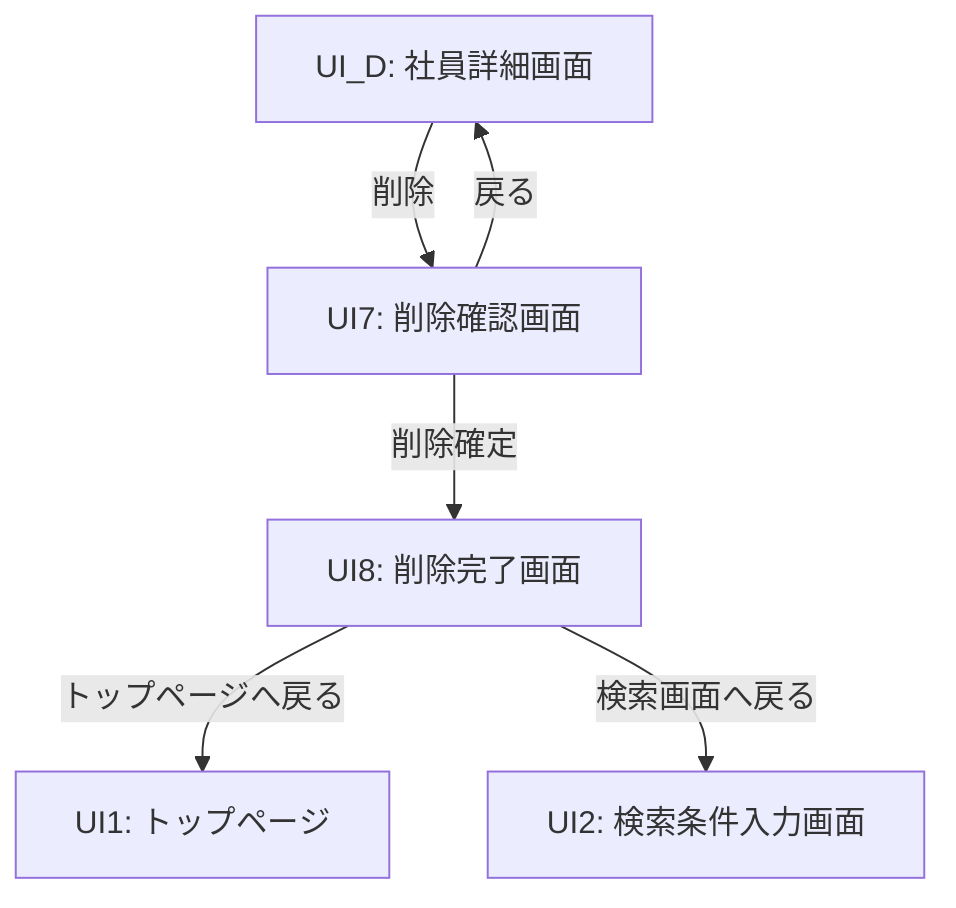
```mermaid
flowchart TD
    UI_D[UI_D: 社員詳細画面] -- "削除" --> UI7[UI7: 削除確認画面]
    
    UI7 -- "削除確定" --> UI8[UI8: 削除完了画面]
    UI7 -- "戻る" --> UI_D
    
    UI8 -->|"トップページへ戻る"| UI1[UI1: トップページ]
    UI8 -->|"検索画面へ戻る"| UI2[UI2: 検索条件入力画面]
```

---

## 5. 画面レイアウト図

各画面のレイアウト仕様を以下に定義する。

### 5.1 共通・検索機能

#### UI1: トップページ

#### UI2: 検索条件入力画面

#### UI3: 検索結果一覧画面

#### UI_D: 社員詳細画面

### 5.2 登録機能

#### UI4: 社員情報登録画面

#### UI5: 登録確認画面

#### UI6: 登録完了画面

### 5.3 変更機能

#### UI9: 変更画面

#### UI10: 変更確認画面

#### UI11: 変更完了画面

### 5.4 削除機能

#### UI7: 削除確認画面

#### UI8: 削除完了画面

---

## 6. データベース仕様

### 6.1 データベース概要

| 項目 | 内容 |
|---|---|
| データベース名 | eimsdb |
| DBMS | MySQL |
| 文字コード | utf8mb4 |
| 照合順序 | utf8mb4_unicode_ci |

### 6.2 テーブルの関係性（実体関連図）
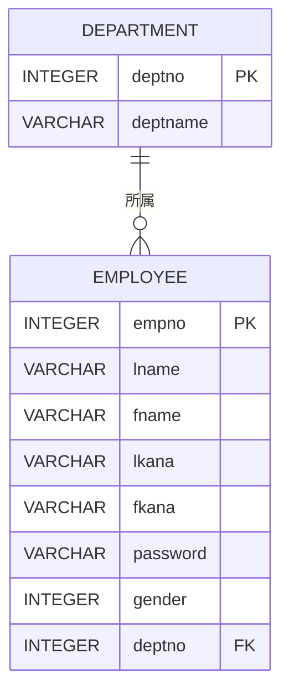
```mermaid
erDiagram
    DEPARTMENT ||--o{ EMPLOYEE : "所属"
    DEPARTMENT {
        INTEGER deptno PK
        VARCHAR deptname
    }
    EMPLOYEE {
        INTEGER empno PK
        VARCHAR lname
        VARCHAR fname
        VARCHAR lkana
        VARCHAR fkana
        VARCHAR password
        INTEGER gender
        INTEGER deptno FK
    }
```

### 6.3 テーブル定義

#### 【部署情報テーブル】(department)
| Field | Type | Null | Key | Default | 説明 |
|---|---|---|---|---|---|
| deptno | INTEGER | NOT NULL | PRIMARY KEY | なし | 部署コード |
| deptname | VARCHAR(10) | NOT NULL | | なし | 部署名 |

#### 【社員情報テーブル】(employee)
| Field | Type | Null | Key | Default | 説明 |
|---|---|---|---|---|---|
| empno | INTEGER | NOT NULL | PRIMARY KEY | AUTO_INCREMENT | 社員番号（自動採番） |
| lname | VARCHAR(10) | NOT NULL | | なし | 氏 |
| fname | VARCHAR(10) | NOT NULL | | なし | 名 |
| lkana | VARCHAR(20) | NOT NULL | | なし | 氏（カナ） |
| fkana | VARCHAR(20) | NOT NULL | | なし | 名（カナ） |
| password | VARCHAR(20) | NOT NULL | | なし | パスワード |
| gender | INTEGER | NOT NULL | | なし | 性別（1:男性 2:女性） |
| deptno | INTEGER | NOT NULL | FOREIGN KEY | なし | 部署コード |

**外部キー制約:**
- 制約名: `fk_employee_department`
- employee.deptno → department.deptno を参照

### 6.4 初期データ仕様

| テーブル | 件数 | 備考 |
|---|---|---|
| department | 6件 | 人事部(100)、経理部(200)、営業部(300)、総務部(400)、開発部(500)、企画部(600) |
| employee | 60件 | テスト用サンプルデータ（社員番号 10001〜10060） |

---

## 7. クラス図（分析レベル）

システムに登場する概念を「バウンダリ（画面）」「コントロール（制御・管理）」「エンティティ（データ）」の役割（BCEモデル）で定義する。

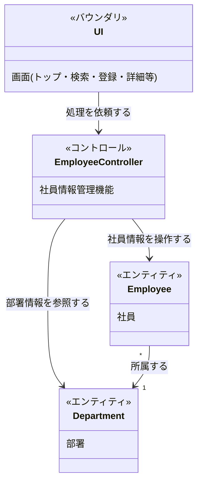
```mermaid
classDiagram
    %% バウンダリ（境界）クラス
    class UI {
        <<バウンダリ>>
        画面 (トップ・検索・登録・詳細等)
    }
    
    %% コントロール（制御）クラス
    class EmployeeController {
        <<コントロール>>
        社員情報管理機能
    }
    
    %% エンティティ（実体）クラス
    class Employee {
        <<エンティティ>>
        社員
    }
    class Department {
        <<エンティティ>>
        部署
    }
    
    %% クラス間の関係（関連と依存）
    UI --> EmployeeController : 処理を依頼する
    EmployeeController --> Employee : 社員情報を操作する
    EmployeeController --> Department : 部署情報を参照する
    Employee "*" --> "1" Department : 所属する
```

---

## 8. シーケンス図（分析レベル）

各ユースケースが実現されるまでのオブジェクト間のメッセージのやり取り（処理の流れ）を以下に定義する。

### 8.1 UC001: 社員情報を検索する
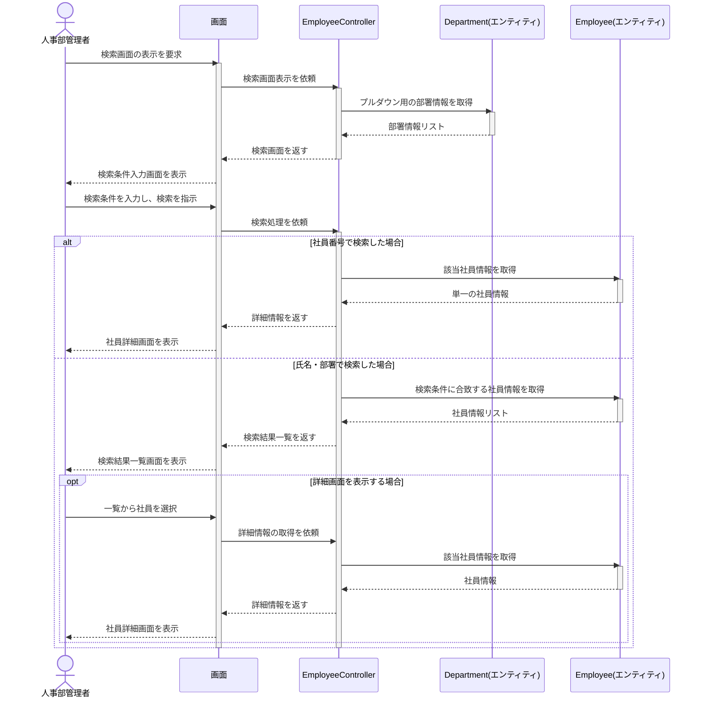
```mermaid
sequenceDiagram
    actor Admin as 人事部管理者
    participant UI as 画面
    participant Ctrl as EmployeeController
    participant Dept as Department(エンティティ)
    participant Emp as Employee(エンティティ)

    Admin ->> UI: 検索画面の表示を要求
    activate UI
    UI ->> Ctrl: 検索画面表示を依頼
    activate Ctrl
    Ctrl ->> Dept: プルダウン用の部署情報を取得
    activate Dept
    Dept -->> Ctrl: 部署情報リスト
    deactivate Dept
    Ctrl -->> UI: 検索画面を返す
    deactivate Ctrl
    UI -->> Admin: 検索条件入力画面を表示
    
    Admin ->> UI: 検索条件を入力し、検索を指示
    UI ->> Ctrl: 検索処理を依頼
    activate Ctrl
    
    alt 社員番号で検索した場合
        Ctrl ->> Emp: 該当社員情報を取得
        activate Emp
        Emp -->> Ctrl: 単一の社員情報
        deactivate Emp
        Ctrl -->> UI: 詳細情報を返す
        UI -->> Admin: 社員詳細画面を表示
    else 氏名・部署で検索した場合
        Ctrl ->> Emp: 検索条件に合致する社員情報を取得
        activate Emp
        Emp -->> Ctrl: 社員情報リスト
        deactivate Emp
        
        Ctrl -->> UI: 検索結果一覧を返す
        UI -->> Admin: 検索結果一覧画面を表示
        
        opt 詳細画面を表示する場合
            Admin ->> UI: 一覧から社員を選択
            UI ->> Ctrl: 詳細情報の取得を依頼
            Ctrl ->> Emp: 該当社員情報を取得
            activate Emp
            Emp -->> Ctrl: 社員情報
            deactivate Emp
            Ctrl -->> UI: 詳細情報を返す
            UI -->> Admin: 社員詳細画面を表示
        end
    end
    
    deactivate Ctrl
    deactivate UI
```

### 8.2 UC002: 社員情報を登録する
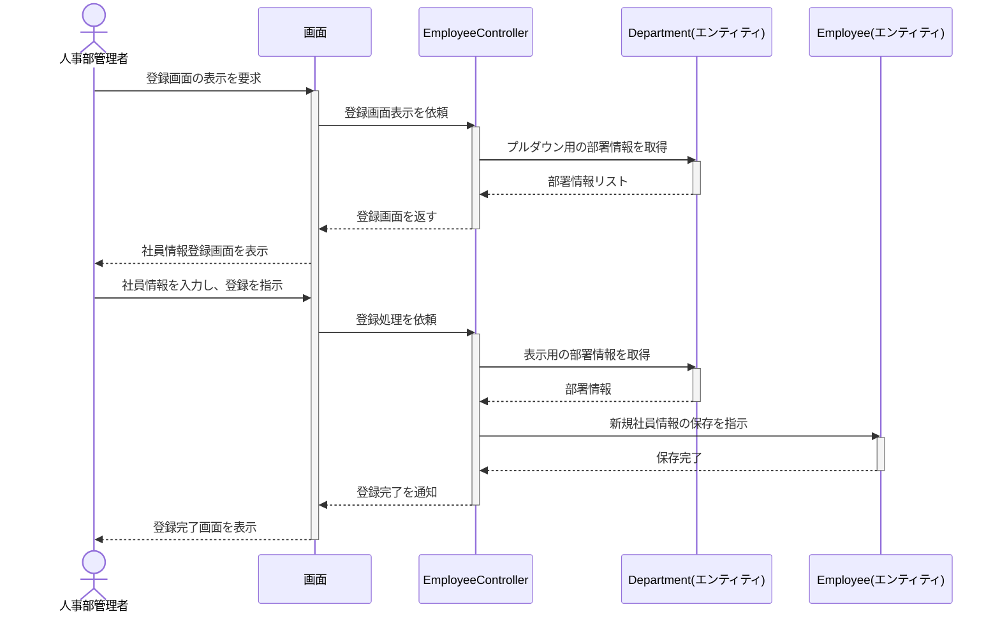
```mermaid
sequenceDiagram
    actor Admin as 人事部管理者
    participant UI as 画面
    participant Ctrl as EmployeeController
    participant Dept as Department(エンティティ)
    participant Emp as Employee(エンティティ)

    Admin ->> UI: 登録画面の表示を要求
    activate UI
    UI ->> Ctrl: 登録画面表示を依頼
    activate Ctrl
    Ctrl ->> Dept: プルダウン用の部署情報を取得
    activate Dept
    Dept -->> Ctrl: 部署情報リスト
    deactivate Dept
    Ctrl -->> UI: 登録画面を返す
    deactivate Ctrl
    UI -->> Admin: 社員情報登録画面を表示

    Admin ->> UI: 社員情報を入力し、登録を指示
    UI ->> Ctrl: 登録処理を依頼
    activate Ctrl
    
    Ctrl ->> Dept: 表示用の部署情報を取得
    activate Dept
    Dept -->> Ctrl: 部署情報
    deactivate Dept
    
    Ctrl ->> Emp: 新規社員情報の保存を指示
    activate Emp
    Emp -->> Ctrl: 保存完了
    deactivate Emp
    
    Ctrl -->> UI: 登録完了を通知
    deactivate Ctrl
    
    UI -->> Admin: 登録完了画面を表示
    deactivate UI
```

### 8.3 UC003: 社員情報を変更する
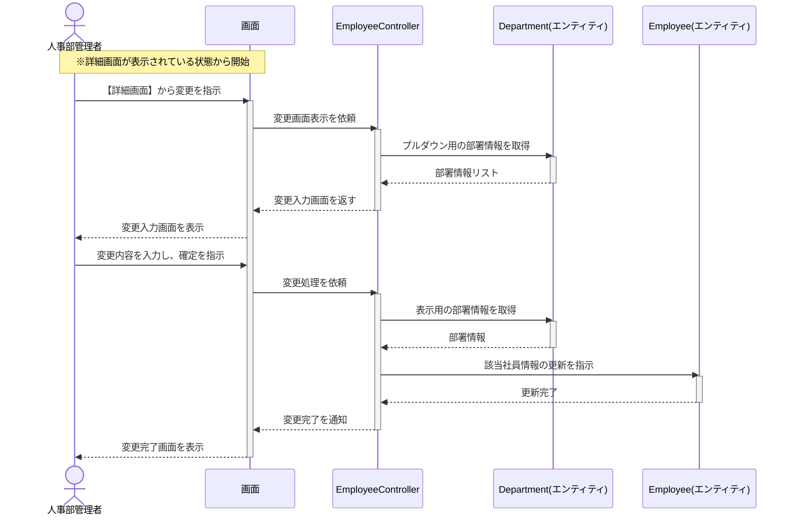
```mermaid
sequenceDiagram
    actor Admin as 人事部管理者
    participant UI as 画面
    participant Ctrl as EmployeeController
    participant Dept as Department(エンティティ)
    participant Emp as Employee(エンティティ)

    note over Admin, UI: ※詳細画面が表示されている状態から開始
    Admin ->> UI: 【詳細画面】から変更を指示
    activate UI
    UI ->> Ctrl: 変更画面表示を依頼
    activate Ctrl
    Ctrl ->> Dept: プルダウン用の部署情報を取得
    activate Dept
    Dept -->> Ctrl: 部署情報リスト
    deactivate Dept
    Ctrl -->> UI: 変更入力画面を返す
    deactivate Ctrl
    UI -->> Admin: 変更入力画面を表示
    
    Admin ->> UI: 変更内容を入力し、確定を指示
    UI ->> Ctrl: 変更処理を依頼
    activate Ctrl
    
    Ctrl ->> Dept: 表示用の部署情報を取得
    activate Dept
    Dept -->> Ctrl: 部署情報
    deactivate Dept
    
    Ctrl ->> Emp: 該当社員情報の更新を指示
    activate Emp
    Emp -->> Ctrl: 更新完了
    deactivate Emp
    
    Ctrl -->> UI: 変更完了を通知
    deactivate Ctrl
    
    UI -->> Admin: 変更完了画面を表示
    deactivate UI
```

### 8.4 UC004: 社員情報を削除する
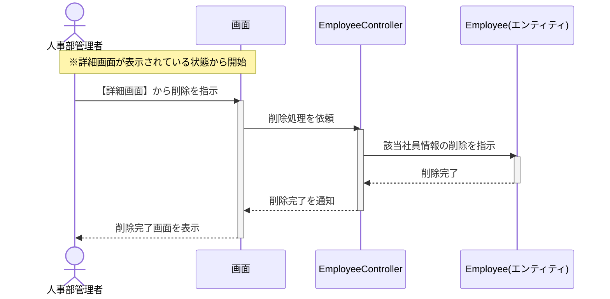
```mermaid
sequenceDiagram
    actor Admin as 人事部管理者
    participant UI as 画面
    participant Ctrl as EmployeeController
    participant Emp as Employee(エンティティ)

    note over Admin, UI: ※詳細画面が表示されている状態から開始
    Admin ->> UI: 【詳細画面】から削除を指示
    activate UI
    UI ->> Ctrl: 削除処理を依頼
    activate Ctrl
    
    Ctrl ->> Emp: 該当社員情報の削除を指示
    activate Emp
    Emp -->> Ctrl: 削除完了
    deactivate Emp
    
    Ctrl -->> UI: 削除完了を通知
    deactivate Ctrl
    
    UI -->> Admin: 削除完了画面を表示
    deactivate UI
```

---

## 9. クラス図（設計レベル）

Spring Bootのアーキテクチャに基づき、各ユースケースの実装に必要なクラスとその依存関係を機能単位で定義する。

### 9.1 UC001: 社員情報を検索する
検索機能におけるクラス構成を以下に定義する。
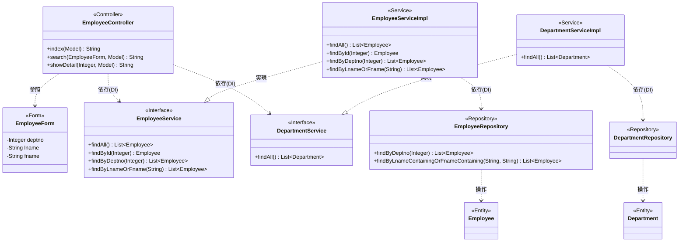
```mermaid
classDiagram
    class EmployeeController {
        <<Controller>>
        +index(Model) String
        +search(EmployeeForm, Model) String
        +showDetail(Integer, Model) String
    }
    class EmployeeForm {
        <<Form>>
        -Integer deptno
        -String lname
        -String fname
    }
    class EmployeeService {
        <<Interface>>
        +findAll() List~Employee~
        +findById(Integer) Employee
        +findByDeptno(Integer) List~Employee~
        +findByLnameOrFname(String) List~Employee~
    }
    class EmployeeServiceImpl {
        <<Service>>
        +findAll() List~Employee~
        +findById(Integer) Employee
        +findByDeptno(Integer) List~Employee~
        +findByLnameOrFname(String) List~Employee~
    }
    class DepartmentService {
        <<Interface>>
        +findAll() List~Department~
    }
    class DepartmentServiceImpl {
        <<Service>>
        +findAll() List~Department~
    }
    class EmployeeRepository {
        <<Repository>>
        +findByDeptno(Integer) List~Employee~
        +findByLnameContainingOrFnameContaining(String, String) List~Employee~
    }
    class DepartmentRepository {
        <<Repository>>
    }
    class Employee { <<Entity>> }
    class Department { <<Entity>> }

    EmployeeController ..> EmployeeService : 依存(DI)
    EmployeeController ..> DepartmentService : 依存(DI)
    EmployeeController ..> EmployeeForm : 参照
    EmployeeServiceImpl ..|> EmployeeService : 実現
    DepartmentServiceImpl ..|> DepartmentService : 実現
    EmployeeServiceImpl ..> EmployeeRepository : 依存(DI)
    DepartmentServiceImpl ..> DepartmentRepository : 依存(DI)
    EmployeeRepository ..> Employee : 操作
    DepartmentRepository ..> Department : 操作
```

### 9.2 UC002: 社員情報を登録する
登録機能におけるクラス構成を以下に定義する。
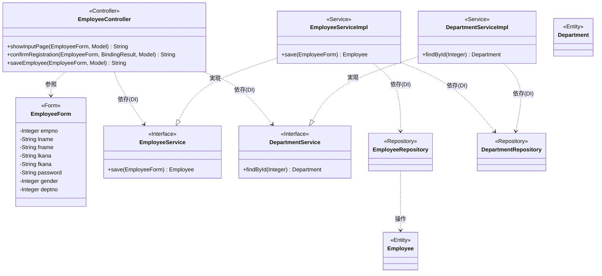
```mermaid
classDiagram
    class EmployeeController {
        <<Controller>>
        +showInputPage(EmployeeForm, Model) String
        +confirmRegistration(EmployeeForm, BindingResult, Model) String
        +saveEmployee(EmployeeForm, Model) String
    }
    class EmployeeForm {
        <<Form>>
        -Integer empno
        -String lname
        -String fname
        -String lkana
        -String fkana
        -String password
        -Integer gender
        -Integer deptno
    }
    class EmployeeService {
        <<Interface>>
        +save(EmployeeForm) Employee
    }
    class EmployeeServiceImpl {
        <<Service>>
        +save(EmployeeForm) Employee
    }
    class DepartmentService {
        <<Interface>>
        +findById(Integer) Department
    }
    class DepartmentServiceImpl {
        <<Service>>
        +findById(Integer) Department
    }
    class EmployeeRepository { <<Repository>> }
    class DepartmentRepository { <<Repository>> }
    class Employee { <<Entity>> }
    class Department { <<Entity>> }

    EmployeeController ..> EmployeeService : 依存(DI)
    EmployeeController ..> DepartmentService : 依存(DI)
    EmployeeController ..> EmployeeForm : 参照
    EmployeeServiceImpl ..|> EmployeeService : 実現
    DepartmentServiceImpl ..|> DepartmentService : 実現
    EmployeeServiceImpl ..> EmployeeRepository : 依存(DI)
    EmployeeServiceImpl ..> DepartmentRepository : 依存(DI)
    DepartmentServiceImpl ..> DepartmentRepository : 依存(DI)
    EmployeeRepository ..> Employee : 操作
```

### 9.3 UC003: 社員情報を変更する
変更機能におけるクラス構成を以下に定義する。
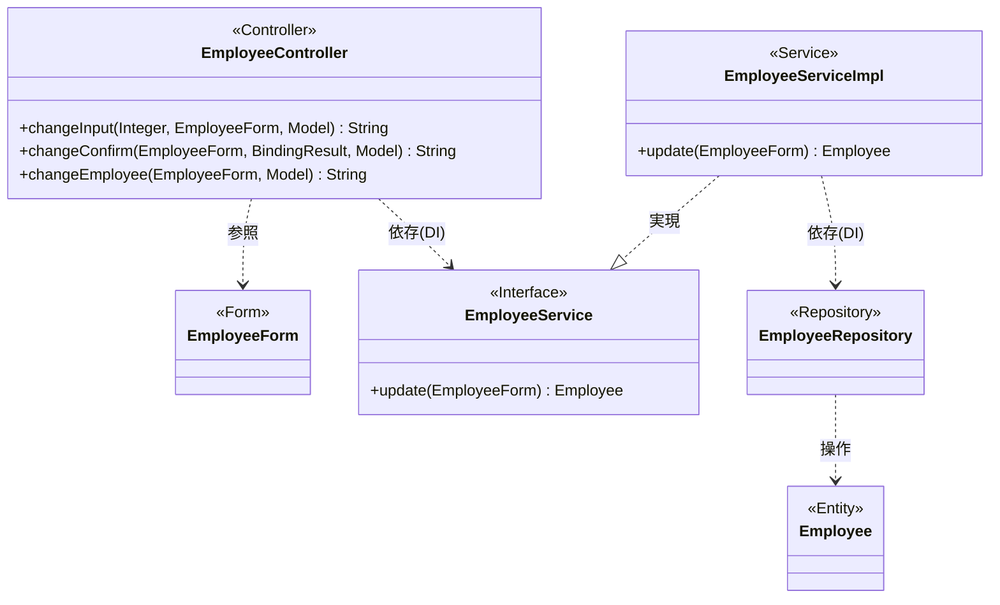
```mermaid
classDiagram
    class EmployeeController {
        <<Controller>>
        +changeInput(Integer, EmployeeForm, Model) String
        +changeConfirm(EmployeeForm, BindingResult, Model) String
        +changeEmployee(EmployeeForm, Model) String
    }
    class EmployeeForm { <<Form>> }
    class EmployeeService {
        <<Interface>>
        +update(EmployeeForm) Employee
    }
    class EmployeeServiceImpl {
        <<Service>>
        +update(EmployeeForm) Employee
    }
    class EmployeeRepository { <<Repository>> }
    class Employee { <<Entity>> }

    EmployeeController ..> EmployeeService : 依存(DI)
    EmployeeController ..> EmployeeForm : 参照
    EmployeeServiceImpl ..|> EmployeeService : 実現
    EmployeeServiceImpl ..> EmployeeRepository : 依存(DI)
    EmployeeRepository ..> Employee : 操作
```

### 9.4 UC004: 社員情報を削除する
削除機能におけるクラス構成を以下に定義する。
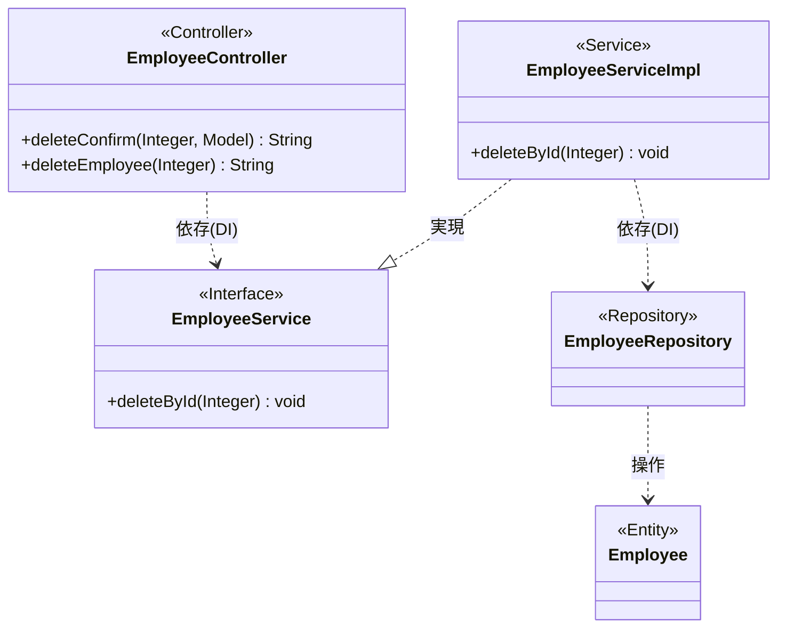
```mermaid
classDiagram
    class EmployeeController {
        <<Controller>>
        +deleteConfirm(Integer, Model) String
        +deleteEmployee(Integer) String
    }
    class EmployeeService {
        <<Interface>>
        +deleteById(Integer) void
    }
    class EmployeeServiceImpl {
        <<Service>>
        +deleteById(Integer) void
    }
    class EmployeeRepository { <<Repository>> }
    class Employee { <<Entity>> }

    EmployeeController ..> EmployeeService : 依存(DI)
    EmployeeServiceImpl ..|> EmployeeService : 実現
    EmployeeServiceImpl ..> EmployeeRepository : 依存(DI)
    EmployeeRepository ..> Employee : 操作
```

### 9.5 全体クラス図
システム全体の網羅的なクラス構成および依存関係を以下に定義する。
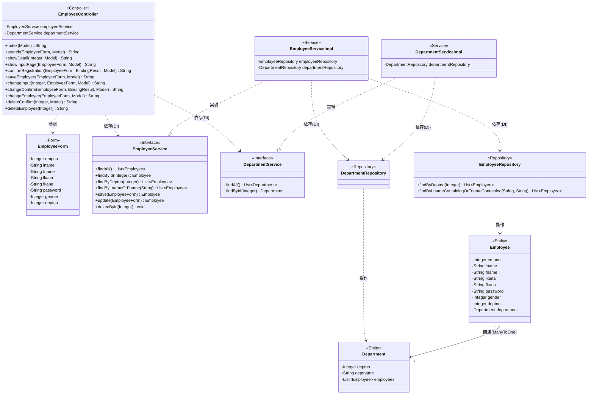
```mermaid
classDiagram
    %% =======================
    %% Controller Layer
    %% =======================
    class EmployeeController {
        <<Controller>>
        -EmployeeService employeeService
        -DepartmentService departmentService
        +index(Model) String
        +search(EmployeeForm, Model) String
        +showDetail(Integer, Model) String
        +showInputPage(EmployeeForm, Model) String
        +confirmRegistration(EmployeeForm, BindingResult, Model) String
        +saveEmployee(EmployeeForm, Model) String
        +changeInput(Integer, EmployeeForm, Model) String
        +changeConfirm(EmployeeForm, BindingResult, Model) String
        +changeEmployee(EmployeeForm, Model) String
        +deleteConfirm(Integer, Model) String
        +deleteEmployee(Integer) String
    }

    %% =======================
    %% Form / DTO Layer
    %% =======================
    class EmployeeForm {
        <<Form>>
        -Integer empno
        -String lname
        -String fname
        -String lkana
        -String fkana
        -String password
        -Integer gender
        -Integer deptno
    }

    %% =======================
    %% Service Layer (Interface & Impl)
    %% =======================
    class EmployeeService {
        <<Interface>>
        +findAll() List~Employee~
        +findById(Integer) Employee
        +findByDeptno(Integer) List~Employee~
        +findByLnameOrFname(String) List~Employee~
        +save(EmployeeForm) Employee
        +update(EmployeeForm) Employee
        +deleteById(Integer) void
    }
    class EmployeeServiceImpl {
        <<Service>>
        -EmployeeRepository employeeRepository
        -DepartmentRepository departmentRepository
    }
    
    class DepartmentService {
        <<Interface>>
        +findAll() List~Department~
        +findById(Integer) Department
    }
    class DepartmentServiceImpl {
        <<Service>>
        -DepartmentRepository departmentRepository
    }

    %% =======================
    %% Repository Layer
    %% =======================
    class EmployeeRepository {
        <<Repository>>
        +findByDeptno(Integer) List~Employee~
        +findByLnameContainingOrFnameContaining(String, String) List~Employee~
    }
    class DepartmentRepository {
        <<Repository>>
    }

    %% =======================
    %% Entity Layer
    %% =======================
    class Employee {
        <<Entity>>
        -Integer empno
        -String lname
        -String fname
        -String lkana
        -String fkana
        -String password
        -Integer gender
        -Integer deptno
        -Department department
    }
    class Department {
        <<Entity>>
        -Integer deptno
        -String deptname
        -List~Employee~ employees
    }

    %% =======================
    %% Relationships
    %% =======================
    EmployeeController ..> EmployeeService : 依存(DI)
    EmployeeController ..> DepartmentService : 依存(DI)
    EmployeeController ..> EmployeeForm : 参照

    EmployeeServiceImpl ..|> EmployeeService : 実現
    DepartmentServiceImpl ..|> DepartmentService : 実現

    EmployeeServiceImpl ..> EmployeeRepository : 依存(DI)
    EmployeeServiceImpl ..> DepartmentRepository : 依存(DI)
    DepartmentServiceImpl ..> DepartmentRepository : 依存(DI)

    EmployeeRepository ..> Employee : 操作
    DepartmentRepository ..> Department : 操作

    Employee "*" --> "1" Department : 関連(ManyToOne)
```

---

## 10. シーケンス図（設計レベル）

各ユースケースの具体的なメソッド呼び出し、およびMVCモデル間（View, Controller, Service, Repository）のデータの流れを以下に定義する。

### 10.1 UC001: 社員情報を検索する
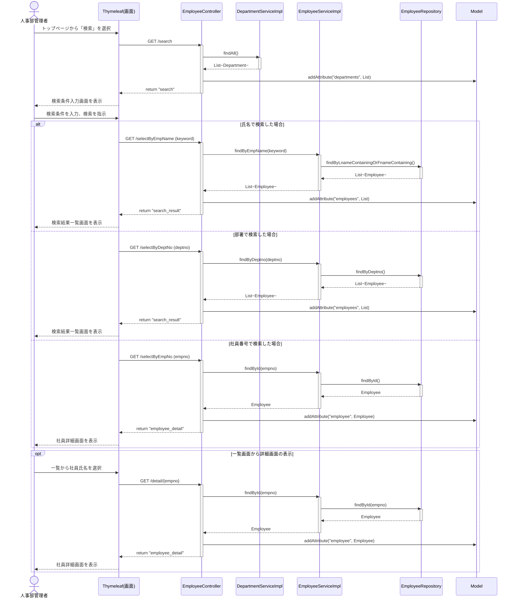
```mermaid
sequenceDiagram
    actor Admin as 人事部管理者
    participant View as Thymeleaf(画面)
    participant Ctrl as EmployeeController
    participant DSvc as DepartmentServiceImpl
    participant Svc as EmployeeServiceImpl
    participant Rep as EmployeeRepository
    participant Model as Model

    Admin ->> View: トップページから「検索」を選択
    View ->> Ctrl: GET /search
    activate Ctrl
    Ctrl ->> DSvc: findAll()
    activate DSvc
    DSvc -->> Ctrl: List~Department~
    deactivate DSvc
    Ctrl ->> Model: addAttribute("departments", List)
    Ctrl -->> View: return "search"
    deactivate Ctrl
    View -->> Admin: 検索条件入力画面を表示
    
    Admin ->> View: 検索条件を入力、検索を指示
    
    alt 氏名で検索した場合
        View ->> Ctrl: GET /selectByEmpName (keyword)
        activate Ctrl
        Ctrl ->> Svc: findByEmpName(keyword)
        activate Svc
        Svc ->> Rep: findByLnameContainingOrFnameContaining()
        activate Rep
        Rep -->> Svc: List~Employee~
        deactivate Rep
        Svc -->> Ctrl: List~Employee~
        deactivate Svc
        Ctrl ->> Model: addAttribute("employees", List)
        Ctrl -->> View: return "search_result"
        deactivate Ctrl
        View -->> Admin: 検索結果一覧画面を表示
        
    else 部署で検索した場合
        View ->> Ctrl: GET /selectByDeptNo (deptno)
        activate Ctrl
        Ctrl ->> Svc: findByDeptno(deptno)
        activate Svc
        Svc ->> Rep: findByDeptno()
        activate Rep
        Rep -->> Svc: List~Employee~
        deactivate Rep
        Svc -->> Ctrl: List~Employee~
        deactivate Svc
        Ctrl ->> Model: addAttribute("employees", List)
        Ctrl -->> View: return "search_result"
        deactivate Ctrl
        View -->> Admin: 検索結果一覧画面を表示
        
    else 社員番号で検索した場合
        View ->> Ctrl: GET /selectByEmpNo (empno)
        activate Ctrl
        Ctrl ->> Svc: findById(empno)
        activate Svc
        Svc ->> Rep: findById()
        activate Rep
        Rep -->> Svc: Employee
        deactivate Rep
        Svc -->> Ctrl: Employee
        deactivate Svc
        Ctrl ->> Model: addAttribute("employee", Employee)
        Ctrl -->> View: return "employee_detail"
        deactivate Ctrl
        View -->> Admin: 社員詳細画面を表示
    end
    
    opt 一覧画面から詳細画面の表示
        Admin ->> View: 一覧から社員氏名を選択
        View ->> Ctrl: GET /detail/{empno}
        activate Ctrl
        Ctrl ->> Svc: findById(empno)
        activate Svc
        Svc ->> Rep: findById(empno)
        activate Rep
        Rep -->> Svc: Employee
        deactivate Rep
        Svc -->> Ctrl: Employee
        deactivate Svc
        Ctrl ->> Model: addAttribute("employee", Employee)
        Ctrl -->> View: return "employee_detail"
        deactivate Ctrl
        View -->> Admin: 社員詳細画面を表示
    end
```

### 10.2 UC002: 社員情報を登録する
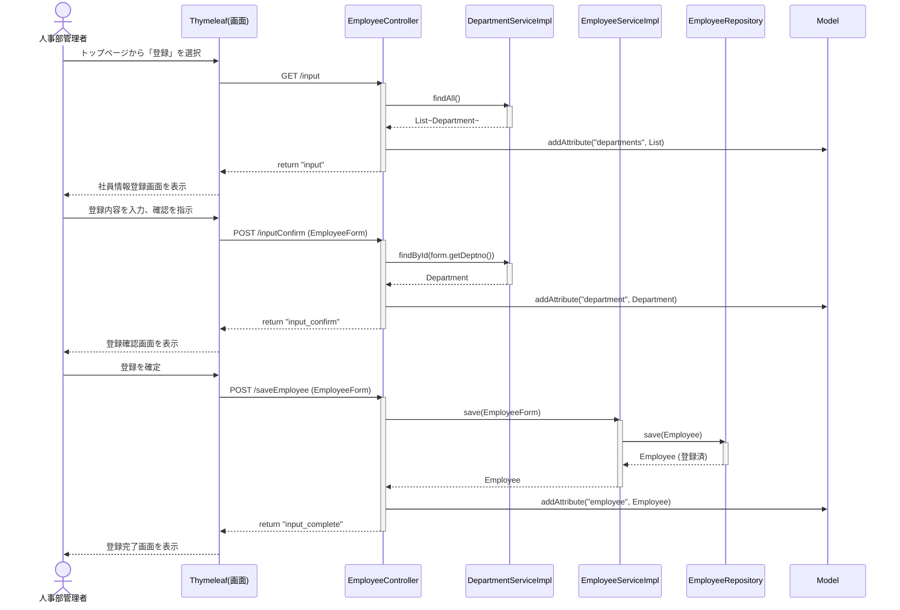
```mermaid
sequenceDiagram
    actor Admin as 人事部管理者
    participant View as Thymeleaf(画面)
    participant Ctrl as EmployeeController
    participant DSvc as DepartmentServiceImpl
    participant Svc as EmployeeServiceImpl
    participant Rep as EmployeeRepository
    participant Model as Model

    Admin ->> View: トップページから「登録」を選択
    View ->> Ctrl: GET /input
    activate Ctrl
    Ctrl ->> DSvc: findAll()
    activate DSvc
    DSvc -->> Ctrl: List~Department~
    deactivate DSvc
    Ctrl ->> Model: addAttribute("departments", List)
    Ctrl -->> View: return "input"
    deactivate Ctrl
    View -->> Admin: 社員情報登録画面を表示

    Admin ->> View: 登録内容を入力、確認を指示
    View ->> Ctrl: POST /inputConfirm (EmployeeForm)
    activate Ctrl
    
    Ctrl ->> DSvc: findById(form.getDeptno())
    activate DSvc
    DSvc -->> Ctrl: Department
    deactivate DSvc
    
    Ctrl ->> Model: addAttribute("department", Department)
    Ctrl -->> View: return "input_confirm"
    deactivate Ctrl
    View -->> Admin: 登録確認画面を表示
    
    Admin ->> View: 登録を確定
    View ->> Ctrl: POST /saveEmployee (EmployeeForm)
    activate Ctrl
    
    Ctrl ->> Svc: save(EmployeeForm)
    activate Svc
    Svc ->> Rep: save(Employee)
    activate Rep
    Rep -->> Svc: Employee (登録済)
    deactivate Rep
    Svc -->> Ctrl: Employee
    deactivate Svc
    Ctrl ->> Model: addAttribute("employee", Employee)
    
    Ctrl -->> View: return "input_complete"
    deactivate Ctrl
    View -->> Admin: 登録完了画面を表示
```

### 10.3 UC003: 社員情報を変更する
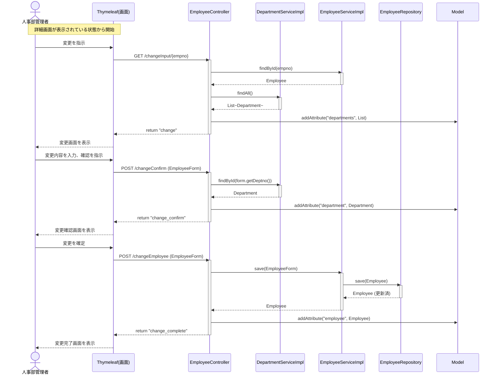
```mermaid
sequenceDiagram
    actor Admin as 人事部管理者
    participant View as Thymeleaf(画面)
    participant Ctrl as EmployeeController
    participant DSvc as DepartmentServiceImpl
    participant Svc as EmployeeServiceImpl
    participant Rep as EmployeeRepository
    participant Model as Model

    note over Admin, View: 詳細画面が表示されている状態から開始
    Admin ->> View: 変更を指示
    View ->> Ctrl: GET /changeInput/{empno}
    activate Ctrl
    Ctrl ->> Svc: findById(empno)
    activate Svc
    Svc -->> Ctrl: Employee
    deactivate Svc
    Ctrl ->> DSvc: findAll()
    activate DSvc
    DSvc -->> Ctrl: List~Department~
    deactivate DSvc
    Ctrl ->> Model: addAttribute("departments", List)
    Ctrl -->> View: return "change"
    deactivate Ctrl
    View -->> Admin: 変更画面を表示
    
    Admin ->> View: 変更内容を入力、確認を指示
    View ->> Ctrl: POST /changeConfirm (EmployeeForm)
    activate Ctrl
    Ctrl ->> DSvc: findById(form.getDeptno())
    activate DSvc
    DSvc -->> Ctrl: Department
    deactivate DSvc
    Ctrl ->> Model: addAttribute("department", Department)
    Ctrl -->> View: return "change_confirm"
    deactivate Ctrl
    View -->> Admin: 変更確認画面を表示
    
    Admin ->> View: 変更を確定
    View ->> Ctrl: POST /changeEmployee (EmployeeForm)
    activate Ctrl
    Ctrl ->> Svc: save(EmployeeForm)
    activate Svc
    Svc ->> Rep: save(Employee)
    activate Rep
    Rep -->> Svc: Employee (更新済)
    deactivate Rep
    Svc -->> Ctrl: Employee
    deactivate Svc
    Ctrl ->> Model: addAttribute("employee", Employee)
    Ctrl -->> View: return "change_complete"
    deactivate Ctrl
    View -->> Admin: 変更完了画面を表示
```

### 10.4 UC004: 社員情報を削除する
```mermaid
sequenceDiagram
    actor Admin as 人事部管理者
    participant View as Thymeleaf(画面)
    participant Ctrl as EmployeeController
    participant Svc as EmployeeServiceImpl
    participant Rep as EmployeeRepository
    participant Model as Model

    note over Admin, View: 詳細画面が表示されている状態から開始
    Admin ->> View: 削除を指示
    View ->> Ctrl: GET /deleteConfirm/{empno}
    activate Ctrl
    Ctrl ->> Svc: findById(empno)
    activate Svc
    Svc -->> Ctrl: Employee
    deactivate Svc
    Ctrl ->> Model: addAttribute("employee", Employee)
    Ctrl -->> View: return "delete_confirm"
    deactivate Ctrl
    View -->> Admin: 削除確認画面を表示
    
    Admin ->> View: 削除を確定
    View ->> Ctrl: POST /deleteEmployee
    activate Ctrl
    Ctrl ->> Svc: deleteById(empno)
    activate Svc
    Svc ->> Rep: deleteById(empno)
    activate Rep
    Rep -->> Svc: void
    deactivate Rep
    Svc -->> Ctrl: void
    deactivate Svc
    Ctrl -->> View: return "delete_complete"
    deactivate Ctrl
    View -->> Admin: 削除完了画面を表示
```
