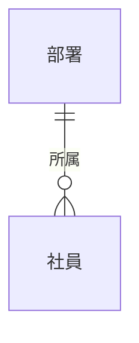
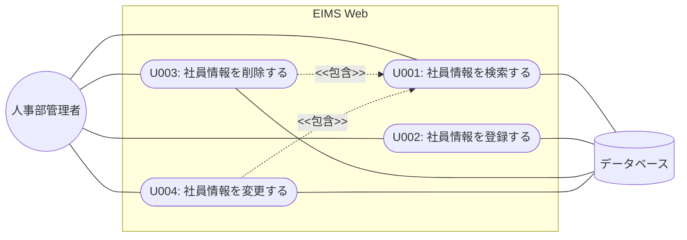
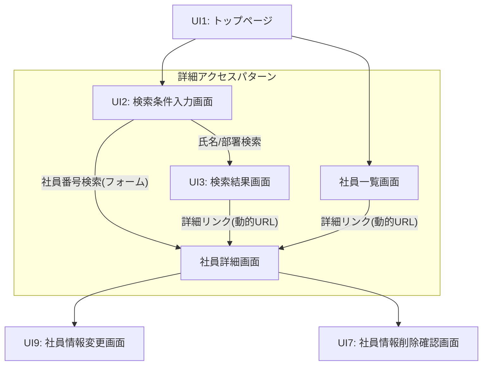

# 総合演習ガイド：社員情報管理システム (EIMS)

## 1. 演習概要
この演習では、社員情報を管理する Web ベースのアプリケーションを構築します。
システム名は **EIMS (Employee Information Management System)** です。

### 1.1 機能概要
EIMS には次の機能が必要です。人事部の管理者が使用します。

| 機能 | 説明 |
|---|---|
| **社員情報検索** | ・社員番号、氏名、又は部署情報を元に、該当する社員情報を表示する。<br>・**社員番号検索**: 1件ヒット時、詳細画面を直接表示する。<br>・**氏名検索**: 「氏」または「名」のいずれかに部分一致したら検索対象とする。<br>・**部署検索**: 部署名を指定して所属社員を一覧表示する。<br>・表示形式: 「社員番号：氏名(フリガナ) : 部署名」。名字と名前間は半角スペース。<br>・不正入力: null又は空文字での検索時は検索画面に留まる。 |
| **社員情報追加** | ・氏名、カナ、パスワード、性別、部署名を入力して登録する。自動採番を使用。 |
| **社員情報削除** | ・社員番号を指定して削除する。存在しない社員は削除できない。 |
| **社員情報変更** | ・氏名、カナ、パスワード、部署コードを入力して更新する。 |

### 1.2 画面構成と詳細画面の役割
本システムでは、**「社員詳細画面」** が各操作（変更・削除）の起点となる「ハブ」の役割を果たします。

- **詳細画面への遷移パターン（重要演習ポイント）**:
    受講生は以下の 2 つの異なるデータ受け取り方法を実装してください。

    | 遷移元 | 方式 | 実装上のポイント |
    |---|---|---|
    | **社員番号検索** | フォーム送信 | 検索フォームから社員番号を送信し、コントローラで詳細画面を直接 `return` する。 |
    | **社員一覧 / 検索結果** | 動的 URL | 各行の「詳細」リンクからパス変数（例: `/detail/1001`）を使用して遷移する。 |

### 1.3 実装レベルの選択（標準 vs 簡易）
各機能の実装難易度を、チームの進捗に合わせて選択してください。

#### 【検索機能】
| 項目 | 標準仕様（レベル★★） | 簡易仕様（レベル★） |
|---|---|---|
| **不正入力ケア** | null・空文字時は検索画面に戻る | ケアなし（エラーにならなければ可） |
| **0件時の挙動** | 「対象なし」のメッセージを表示 | ケアなし（空のテーブルで可） |
| **氏名検索項目** | **氏** または **名** の2項目 OR 検索 | **氏（漢字）** のみの一致検索 |
| **部署検索方式** | **部署名** を選択（プルダウン） | **部署コード** を直接入力 |

#### 【登録・更新フロー】
| 項目 | 標準仕様（レベル★★） | 簡易仕様（レベル★） |
|---|---|---|
| **フロー構成** | 入力 → **確認画面** → 完了 | 入力 → 完了（確認なし） |
| **データ保持** | 修正ボタンで入力値を保持する | ケアなし（消えても可） |

---

## 2. 演習の進め方
以下の手順に従い、システムを構築してください。

| 順序 | 作業 | 説明 | 成果物 |
|---|---|---|---|
| 1 | 要件定義の内容確認 | 各種ドキュメント（ユースケース、UIフロー等）を元に要件を理解します。 | （配布資料を利用） |
| 2 | 設計の内容確認 | 設計レベルのクラス図を理解します。 | （配布資料を利用） |
| 3 | プログラミング | 設計モデルどおりにコーディングします。 | ソースコード |
| 4 | テスト | テストケースに基づきテストを行います。 | テスト結果報告書 |

---

## 3. ドキュメントについて
各工程で利用・作成する成果物は以下の通りです。

| 工程 | 成果物 | 検索 | 登録 | 削除 | 変更 |
|---|---|:---:|:---:|:---:|:---:|
| 要件定義 | ユースケース図 / 仕様書 / UIフロー / 画面レイアウト | ※ | ※ | ※ | ※ |
| 分析・設計 | クラス図（分析・設計） / シーケンス図 | ※ | ※ | ※ | ※ |
| 実装 | ソースコード | ○ | ○ | ○ | ○ |
| テスト | テストケース仕様書.xls | ○ | ○ | ○ | ○ |

※：提供資料を利用。 ○：自身で作成。

---

## 4. データベース仕様

### 4.1 テーブルの関係性（実体関連図）


---

## 5. ユースケース図


---

## 6. ユースケース仕様書
（詳細は原本の Page 19 〜 24 の詳細な代替フローを含めて実装してください）

---

## 7. UI フロー図（画面遷移図）


---

## 8. 画面レイアウト図
※本セクションは、システムの実際の動作画面をスクリーンショットで撮影し、後に挿入する予定です。

---

## 9. 設計レベルクラス図
```mermaid
classDiagram
    class EmployeeController {
        <<コントローラ>>
        +index() 文字列
        +showInputPage() 文字列
        +inputConfirm() 文字列
        +saveEmployee() 文字列
    }
    class EmployeeService {
        <<インターフェース>>
        +saveEmployee() 社員
    }
    class EmployeeServiceImpl {
        <<サービス実装>>
    }
    class EmployeeForm {
        <<フォーム>>
    }
    class Employee {
        <<エンティティ>>
    }
    
    EmployeeController -- 使用 --> EmployeeService
    EmployeeServiceImpl ..|> EmployeeService : 実現
    EmployeeController ..> EmployeeForm : 参照
```
