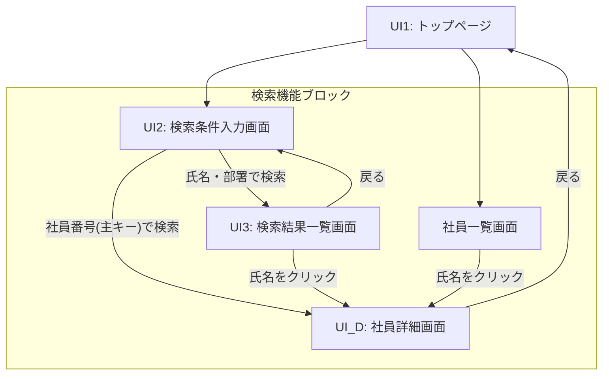

# 総合演習ガイド：社員情報管理システム (EIMS)

## 1. 演習概要
この演習では、社員情報を管理する Web ベースのアプリケーションを構築します。
システム名は **EIMS (Employee Information Management System)** です。

### 1.1 検索機能の仕様定義
本システムにおける検索機能は、以下のプロセスを含みます。人事部の管理者が、特定の社員を特定し、その詳細情報を確認することを目的とします。

| プロセス | 詳細仕様 |
|---|---|
| **社員番号検索** | 社員番号をフォームより送信し、該当する社員が存在する場合、直接 **「社員詳細画面」** を表示する。 |
| **社員名検索** | 氏名（氏または名）をキーワードとし、部分一致検索を行う。検索結果は **「検索結果一覧画面」** に表示する。一覧画面の氏名をクリックすることで、詳細画面へ遷移できる。 |
| **部署検索** | 部署情報を条件に検索を行う。検索結果は一覧表示する。 |
| **詳細情報の参照** | 検索プロセスにより特定された社員の全項目（社員番号、氏名、カナ、性別、部署）を表示する。 |

#### 【共通の挙動ルール】
- **入力値の検証**: キーワードが null または空文字の場合は、遷移を行わず検索画面に留まること。
- **検索結果不在時の対応**: 該当する社員が存在しない場合は、結果一覧のテーブルを表示せず、「該当する社員は存在しませんでした」というメッセージを提示すること。
- **氏名の表示ルール**: 氏名およびカナを表示する際は、名字と名前の間を**半角スペース**で連結すること。

### 1.2 実装仕様の選択と簡略化指針
開発の進捗状況や技術的な難易度を考慮し、各チームで以下の実装方針を選択してください。

#### 【検索機能における仕様の差異】
| 項目 | 標準的な実装（推奨） | 簡略化された実装 |
|---|---|---|
| **未入力時の処理** | null・空文字のバリデーションを実装 | 特になし（エラーにならないことを優先） |
| **0件時の処理** | メッセージ表示による例外処理を実装 | 特になし（空の表を表示） |
| **氏名検索の範囲** | **氏** または **名** の 2 項目 OR 検索 | **氏（漢字）** のみの単一項目検索 |
| **部署検索の方法** | **部署名** を選択（プルダウン形式） | **部署コード** を直接入力（テキスト形式） |

---

## 2. 演習の進め方
（省略：原本 Page 4 に準拠）

---

## 3. 画面遷移図（検索機能プロセス）

---

## 4. ユースケース仕様書

### UC001: 社員情報の検索と詳細表示
| 項目 | 内容 |
|---|---|
| **目的** | 複数の検索条件に基づき、特定の社員を特定し、その詳細情報を参照する。 |
| **基本フロー（社員番号検索）** | 1. 管理者は検索画面で社員番号を入力し、実行する。 2. システムは該当する社員 1 件を検索し、**社員詳細画面** を直接表示する。 |
| **基本フロー（一覧からの参照）** | 1. 管理者は一覧または検索結果の**氏名リンク**を押下する。 2. システムはパス変数から社員番号を特定し、**社員詳細画面** を表示する。 |
| **代替フロー（検索対象なし）** | 検索条件に合致する社員が存在しない場合、結果一覧画面に「該当する社員は存在しませんでした」と表示する。 |

---

## 5. データベース仕様
（詳細は原本の Page 6 を参照）
